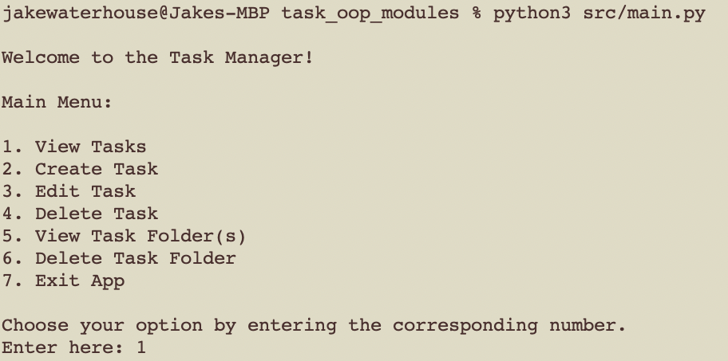
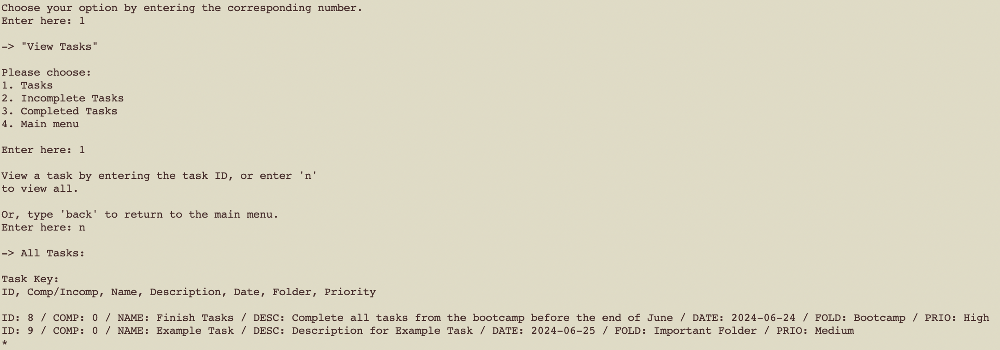
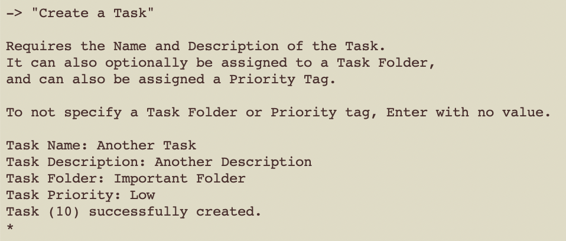
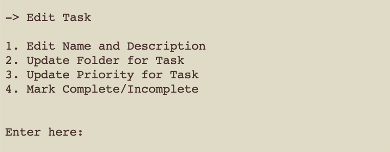
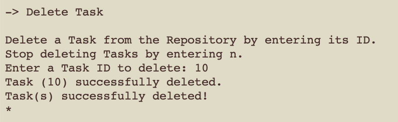
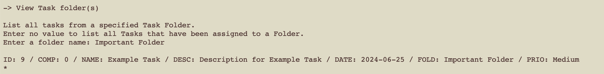
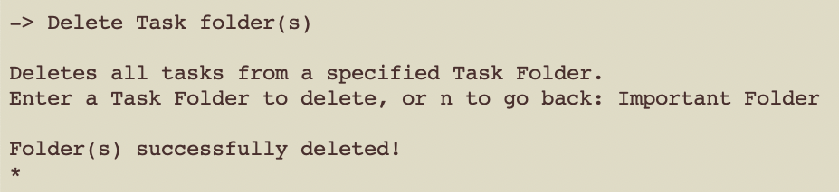
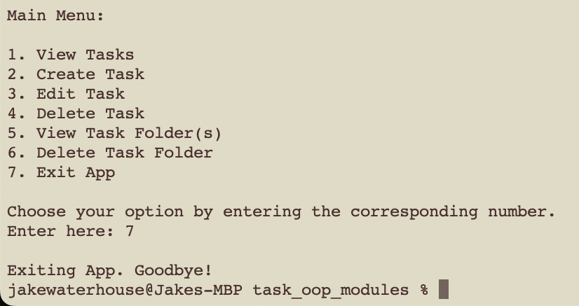

# **Task Manager** 📔🖋️
### Task: OOP - Modules

## **Contents**

- [Installation](#installation)
- [Usage](#usage)
- [Credit](#credit)

In this task, I created a Task Manager application operated from the terminal. In this application, users have CRUD functionalities for the tasks, and can assign them to folders 
or tag them with priority.

This task was essential for me in learning SQL queries and how to control Relational Database Management Systems with Python, as I went further in-depth with manually coding CRUD 
functionalities, and for performing the necessary checks so the database updated correctly and the program operates successfully.

## **Installation**

To use the application, you must clone the repository to your machine.

## **Usage**

To run the program, in your terminal you must cd into the cloned repository and then run `python src/main.py` or `python3 src/main.py` dependant on your python installation.

There are multiple functions of this application. You can:

### View Tasks:

View tasks by their specific ID number, by complete/incomplete, or just view all.

### Create Task:

Create a task by entering: `Task Name`; `Task Description`; `Task Folder` (Optional); `Task Priority` (Optional). 

`Task ID`, `Complete` and `Date Created` are automatically created parameters:
* `Task ID`: Auto-incrementing ID number
* `Complete`: Default set to 0 (or False)
* `Date Created`: Stores the current date when the task is created.

### Edit Task:

There are 4 options for editing tasks:
* Edit Name and Description
* Update Folder for Task
* Update Priority for Task
* Mark Complete/Incomplete
* or return to the Main menu

All the options will ask for a `Task ID` once selected, and will allow you to edit what the desired choice was.

### Delete Task:

Delete a task selected by its ID.

### View Task Folder:

Allows the user to search all tasks from a specified `Task Folder`, or if the user enters nothing then only tasks that have been assigned to any folder will be listed. With this 
option, if a task has not been assigned to a task folder, the it will not be listed.

### Delete Task Folder:

Specify a `Task Folder` to have the entire task folder deleted

### Exit App:

Quit the application.

## **Credit**

**Jake Waterhouse:**
* [GitHub Profile](https://github.com/jake-wh)
* [Linked Profile](https://www.linkedin.com/in/jake-waterhouse/)

Happy Task Managing! 😃

